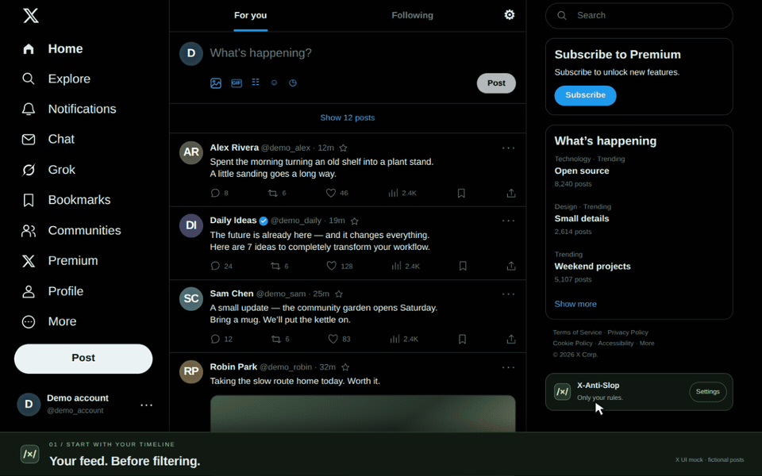

<p align="center">
  
</p>

<h1 align="center">X-Anti-Slop</h1>

I made this because X/Twitter's muted words don't support regular expressions. I wanted to filter out some of the repetitive stuff in my feed.

It's a browser extension for Firefox and Chrome-based browsers. You add patterns, and it hides posts that match them. Filters and settings stay in your browser.



The demo uses a mock feed with fictional posts.

## Install

- [Firefox Add-ons](https://addons.mozilla.org/en-US/firefox/addon/x-anti-slop/): submitted, waiting for review.
- [Chrome Web Store](https://chromewebstore.google.com/detail/x-anti-slop/eeiaamkmlgpkkiojjicfplcnmdmflapm): submitted, waiting for review.

The store pages may be unavailable until approval. For now, you can build and load the extension locally.

Once Mozilla approves a version, GitHub Actions adds its signed `.xpi` to the [GitHub release](https://github.com/tasarren/x-anti-slop/releases/latest). Download that file, open Firefox's `about:addons`, and choose **Install Add-on From File…** from the gear menu. It stays installed after a restart and receives updates from Firefox Add-ons.

The ZIPs are for development. Chrome users should use the store once it's approved, or follow the **Load unpacked** steps below. A `.crx` download wouldn't bypass Chrome's installation restrictions.

## Development guide

Use Git, Node 24, and npm. From the project directory, run:

```sh
npm ci
npm run package
```

This creates the Firefox build in `dist/firefox` and the Chromium build in `dist/chromium`. ZIP packages are in `artifacts`.

CI builds are also available from the repository's **Actions** tab. Extract the browser ZIP before following the steps below.

### Firefox

1. Open `about:debugging#/runtime/this-firefox`.
2. Click **Load Temporary Add-on**.
3. Select `dist/firefox/manifest.json`, or the manifest from an extracted Firefox ZIP.
4. Allow access to X if Firefox asks, then reload your X tabs.

Firefox removes temporary add-ons when it restarts. The store version will need Mozilla's signing before it can stay installed.

You can pin the extension from Firefox's puzzle-piece menu. There's also a settings card on X, between **More** and **Post**.

### Chrome, Edge, Brave, and other Chromium browsers

1. Open `chrome://extensions`, `edge://extensions`, or your browser's extensions page.
2. Enable **Developer mode**.
3. Click **Load unpacked** and select `dist/chromium`, or the folder from an extracted Chromium ZIP.
4. Reload your X tabs.

The current builds target Firefox 140+, Firefox for Android 142+, and Chromium 109+. Your browser must support extensions.

### Filters

Open the settings card on X, add a pattern, and click **Save changes**. On narrow screens, the card becomes an icon.

By default, matching posts leave a small notice. Click **Show** to read one, or choose **Hide it completely** in settings to remove the row.

The default pattern looks for an em dash or either guillemet:

```regex
.?[—«»].?
```

It uses the `u` flag. You can change it, remove it, or add more filters. These are text matches, so they'll also catch people who use the same punctuation.

Enter the pattern without surrounding `/` characters. Put flags in the separate field. A post is hidden when any enabled filter matches.

| Pattern | Flags | What it matches |
| --- | --- | --- |
| `[—«»]` | `u` | An em dash or either guillemet |
| `\b(giveaway\|airdrop)\b` | `i` | Either word, ignoring case |
| `^sponsored` | `im` | A line starting with “sponsored” |

Use **Try your filters** to check some text before saving. **Reset defaults** edits the form, so you still need to save afterward. It keeps your whitelist.

### Accounts and quoted posts

Click the star beside an account's name to whitelist it. The star turns green. Click it again to apply filters to that account.

You can also use **Whitelist** on a hidden-post notice or add a handle in settings. Whitelist changes save immediately.

The extension checks quoted posts separately. Each post uses its own author's whitelist status. If only a quote matches, the extension hides it and leaves the author's comment visible.

### Working on the code

| Command | What it does |
| --- | --- |
| `npm run build` | Build both browser versions |
| `npm run typecheck` | Check TypeScript types |
| `npm test` | Build, package, and run the tests |
| `npm run package` | Run the tests and Firefox validation, then leave the ZIPs in `artifacts` |
| `npm run preview` | Start the local settings and mock-feed preview |

After a rebuild, reload the extension and your X tabs. The preview uses separate settings and doesn't touch your X account.

The [development guide](docs/DEVELOPMENT.md) covers the source files and browser checks. See [CONTRIBUTING.md](CONTRIBUTING.md) for changes and bug reports.

The extension only checks text that X has loaded. It doesn't scan images or videos. Very expensive regex patterns can slow the tab down.

Version 0.1.0. [MIT license](LICENSE). [Privacy](docs/PRIVACY.md). [Security reports](SECURITY.md).

Not affiliated with X or any browser vendor.
